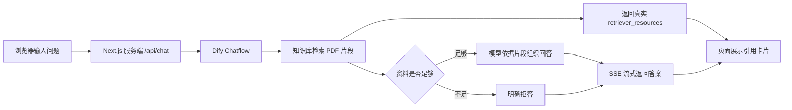

# 知源 Zhiyuan：零基础也能复刻的 Dify + Next.js RAG 学习助手

> 从 PDF 知识库、流式回答、真实引用，到15题严格评估——完整记录一个 RAG 项目从“能运行”到“敢公开”的过程。

## 项目开场

很多 RAG 教程停在“上传 PDF 后能够回答问题”这一步，但真正的问题是：它找对资料了吗？引用真的支持答案吗？资料不足时会不会胡编？

知源从一个大一微积分学习助手开始，完整实现了 PDF 知识库、流式问答、真实引用、无资料拒答和固定评估集，并诚实记录了复杂 PDF 中公式、跨页内容和相邻例题带来的检索问题。

这里的 **RAG（Retrieval-Augmented Generation，检索增强生成）**，可以简单理解为：AI 回答前先从指定资料中找依据，再根据找到的内容组织答案。知源不是完整课程平台，也不是成熟企业产品，而是一个可以复现、检查和继续学习的 v0.1 原型。

## 30秒了解知源

| 你可能关心的问题 | 知源 v0.1 的回答 |
| --- | --- |
| 它现在能做什么？ | 围绕指定 PDF 资料回答问题，逐步显示答案，并给出本次真实检索片段。 |
| 首个验证场景是什么？ | 大一微积分，用来测试中文问题检索英文资料、数学公式、相邻片段和严格引用。 |
| 只能处理微积分吗？ | 不是。微积分只是首个验证场景；相同框架可以更换为其他经过授权的知识包。 |
| 回答可靠吗？ | REFUSE 题表现稳定，但10道应回答题中只有3道满足严格证据标准，失败情况完整保留。 |
| 适合直接上线吗？ | 还不适合。当前是本地演示版本，公开服务仍需部署、限流、隐私和资料授权检查。 |

## 在线演示状态

目前**没有公开在线演示地址**。项目在 Windows 本机运行，Next.js 网站与本地 Dify 通过服务端接口连接。

在公开演示之前，还需要完成域名与 HTTPS、匿名访问频率限制、日志和隐私策略，以及演示资料的公开授权确认。README 不提供虚构链接，也不会把本地 API Key 放进仓库。

## 它能做什么

- **接入指定学习资料：** 资料由维护者手动上传到 Dify 知识库，避免普通用户上传带来的版权和审核问题。
- **中文提问检索英文 PDF：** 向量检索会比较文字含义，而不只是寻找完全相同的关键词，因此中文问题有机会找到英文课件中的相关段落。
- **像聊天一样显示回答：** 通过 SSE（服务器持续发送小段消息的方式）流式传输，文字会逐步出现，不需要等待完整答案一次性返回。
- **正确显示公式和排版：** 回答支持 Markdown 标题、加粗、列表，以及 LaTeX 数学公式渲染。
- **展示真实检索来源：** 引用直接读取 Dify 返回的 `retriever_resources`，包括文件名、相关分数、文档 ID、片段 ID 和原文；不是让模型自己编一个来源。
- **资料不足时拒答：** 对知识库之外的问题、考试原题预测和老师未公开的要求，系统会说明没有足够依据。
- **把 API Key 留在服务端：** 浏览器只访问本站 `/api/chat`，由 Next.js 服务端代理 Dify，真实密钥不会发送到前端。
- **固定题目重复评估：** 同一批测试题用于比较每次调整，人工检查“找到了什么”和“答案是否真的被引用支持”。
- **可以复现关键配置：** Git 保存网站代码、测试集和不含密钥的 Dify DSL（工作流配置文件），新环境可以按相同步骤恢复。

## 为什么做这个项目

一个数学答案“看起来正确”，可能只是大模型使用了自身知识；一个引用“来自正确文件”，也可能只是封面、相邻题目或下一页的替代解法。

知源把重点放在可核对性上：先保存检索片段，再检查答案中的核心定义、公式、步骤和结论是否都能回到这些片段。大一微积分非常适合作为首个验证场景，因为它同时包含中英文表达、密集公式、跨页解答和相似例题，容易暴露简单演示看不到的问题。

这套框架并不限定学科。v0.2 计划加入一个**企业制度演示知识包**，使用可公开或自行编写的制度材料，验证同一套问答、引用和拒答机制在非课程场景中的表现。

## 跟着这个项目，你会接触什么？

- **RAG 是什么：** 为什么先找资料再回答，以及它仍然可能在哪些地方失败。
- **Dify Chatflow：** 怎样用可视节点串起问题输入、知识检索、资料不足判断和回答。
- **PDF 如何进入知识库：** Dify 怎样解析文档、建立索引，并把片段交给检索流程。
- **Chunk 与 Embedding：** Chunk 是切开的文本片段；Embedding 是把文字含义转成数字表示，帮助中文问题找到英文内容。
- **为什么 Next.js 放在 Dify 前面：** 网站服务端统一鉴权、转发流式事件，并避免浏览器直接接触 Dify 密钥。
- **API Key 为什么不能放浏览器：** 前端代码和网络请求可以被使用者查看，公开密钥可能被滥用。
- **SSE 怎样实现流式回答：** 服务端连续发送 `answer.delta`，页面边收到边渲染。
- **引用怎样读取：** 回答结束时从 `retriever_resources` 保留真实来源，再按 `document_id + segment_id` 去重。
- **为什么需要固定测试集：** 没有同一批题目的前后对照，就很难判断一次调整是否真的有效。
- **怎样判断调参效果：** 一次只改变一个变量，同时观察改善、退化、延迟和拒答，而不是只挑成功案例。

README 只提供整体地图。需要继续学习时，可以阅读：

- [项目术语表](docs/project-glossary.md)
- [项目决策记录](docs/project-decisions.md)
- [v0.1 最终评估](docs/v0.1-final-evaluation.md)

## 一次提问是怎样完成的



浏览器始终只连接知源网站。Dify API Key 由 Next.js 服务端读取；Dify 返回的真实引用由服务端解析，不放进模型自行生成的结构化输出中。

## 页面与功能截图

当前仓库没有可以安全公开的成品截图。已有本地诊断图片包含课程原文，因此被 Git 忽略，不会为了装饰 README 而提交。

公开截图待办：

- TODO：首页或本地项目入口截图；
- TODO：AI 问答页面截图；
- TODO：使用自编演示资料生成的真实引用卡片截图；
- TODO：隐藏工作空间和私人信息后的 Dify Chatflow 结构图；
- TODO：不含课程原文的最终评估结果摘要图。

添加截图前必须再次检查：不能出现 API Key、Bearer Token、本机路径、私人账号信息或未授权课程原文。

## 零基础快速开始

### 1. 克隆仓库

在 PowerShell 中执行：

```powershell
git clone https://github.com/JW045-ctrl/zhiyuan-rag.git
Set-Location .\zhiyuan-rag
```

### 2. 先分清两个目标

> [!IMPORTANT]
> **运行网站代码**和**从零恢复完整 Dify 知识库**不是同一件事。网站可以从本仓库安装、测试和构建，但仅导入 DSL 不会自动恢复模型、课程资料、知识库索引或应用密钥。

本仓库不包含：

- 模型供应商凭据；
- 已建好的 Dify 知识库；
- 课程 PDF；
- 课程资料内容；
- Dify 应用 API Key；
- 本地 Dify 数据库。

如果只想运行网站代码，需要一个已经发布并可以访问的 Dify Chatflow，以及该应用自己的 API Key。

如果要从零恢复完整 Dify 问答环境，导入仓库中的 DSL 后仍需：

1. 配置自己的模型供应商和模型凭据；
2. 新建知识库；
3. 上传自己有权使用的资料；
4. 将 Chatflow 的知识检索节点重新绑定到新知识库；
5. 发布应用并创建自己的 API Key。

具体步骤见 [Dify Chatflow 搭建说明](#dify-chatflow-搭建说明)。

### 3. 准备环境

- Windows 10/11 与 PowerShell；
- Node.js 20.9 或更高版本；
- npm 10 或更高版本；
- 已启动的 Dify 1.16.1；
- 一个由 Dify 发布的 Chatflow 应用 API Key。

### 4. 安装网站依赖

如果当前网络确实需要代理，请在运行 `npm ci` **之前**设置。代理端口必须以自己的代理软件为准；下面的环境变量只作用于当前 PowerShell 窗口，不会永久修改系统设置：

```powershell
$env:HTTP_PROXY='http://127.0.0.1:7897'
$env:HTTPS_PROXY='http://127.0.0.1:7897'
```

不需要代理时请跳过上面的两行。然后安装锁定版本的依赖：

```powershell
npm.cmd ci
```

安装时，npm 可能提示 `esbuild` 的安装脚本尚未列入 `allowScripts` 审阅清单。该提示不是本次验证发现的安全漏洞：本次 `npm ci`、测试和构建均成功，npm 审计结果为0个已知漏洞。它也不代表依赖永远没有风险，后续升级依赖时仍应继续审阅；新用户不必因为这一条提示误以为整个安装已经失败。

### 5. 创建本地环境变量

```powershell
Copy-Item .env.example .env.local
```

编辑 `.env.local`：

```dotenv
DIFY_API_BASE_URL=http://localhost/v1
DIFY_API_KEY=在这里填写自己的Dify应用Key
```

`.env.local` 已被 Git 忽略。请勿添加 `NEXT_PUBLIC_` 前缀，也不要把真实 Key 贴进 Issue、截图或提交记录。

### 6. 安装后的自检

下面四条命令不会运行15题付费评估：

```powershell
npm.cmd run test
npm.cmd run typecheck
npm.cmd run build
npm.cmd run rag:evaluate:check
```

- `test`：检查 SSE 解析、引用去重、Markdown 和 LaTeX 渲染等自动测试；
- `typecheck`：检查 TypeScript 类型错误；
- `build`：确认 Next.js 可以生成生产构建；
- `rag:evaluate:check`：只检查测试集 JSON 格式和启用题数量，不调用 Dify 或模型。

### 7. 启动网站

```powershell
npm.cmd run dev
```

打开：

- 首页：<http://127.0.0.1:3000>
- AI 学习助手：<http://127.0.0.1:3000/assistant>

如果3000端口被占用，以终端显示的实际端口为准。

## 分享项目之前

`.env.local` 可能包含真实的 Dify API Key；`.next` 是 Next.js 生成的本地构建与开发缓存，其中可能保留服务端环境值。不要直接压缩整个开发目录发送给他人，优先分享 GitHub 仓库地址。

如需清理本地副本，可以在项目目录执行：

```powershell
Remove-Item .env.local -ErrorAction SilentlyContinue
Remove-Item .next -Recurse -Force -ErrorAction SilentlyContinue
```

这些命令不会删除仓库中的 `.env.example`。

## Dify Chatflow 搭建说明

仓库保存了 Dify 1.16.1 导出的 Chatflow DSL：

```text
dify/chatflow/zhiyuan-calculus-v0.1.yml
```

恢复流程：

1. 在 Dify 工作室导入 DSL；
2. 配置自己的通义千问模型供应商凭据；
3. 创建一个知识库，并上传自己整理、获得授权或允许公开使用的资料；
4. 将 Chatflow 的知识检索节点重新绑定到新知识库；
5. 检查资料不足判断和拒答分支；
6. 发布 Chatflow，创建应用 API Key；
7. 只把 Key 写入网站服务端 `.env.local`；
8. 用 `/assistant` 检查流式回答和真实引用字段。

知源 v0.1 冻结配置为：知识库 Top K=`10`、Chatflow Top K=`4`、Score 阈值=`0.5`、Embedding=`text-embedding-v4`、Rerank关闭。它们是本次评估基线，不代表适合所有资料；如果更换知识包，应建立新的固定测试集后再单变量比较。

详细恢复说明见 [Dify 配置说明](dify/README.md)。DSL 不包含模型供应商凭据、Dify API Key 或本机数据库内容。

## 项目结构

```text
src/app/api/chat/          Next.js 服务端 Dify 代理
src/app/assistant/         AI 问答页面
src/lib/dify/              Dify 客户端、类型和 SSE 解析
dify/chatflow/             可导入的 Dify Chatflow DSL
evaluation/                测试题、JSON Schema 与评估说明
scripts/                   RAG 批量评估脚本
docs/                      决策、术语、审计与最终评估文档
data/resources/            本地资料目录说明；真实 PDF 不提交
```

`next-env.d.ts` 是 Next.js 自动生成的类型声明文件，已被 Git 忽略，不需要人工维护。运行 `next dev`、`next build` 或 `next typegen` 时，Next.js 会按当前环境重新生成它；`tsconfig.json` 仍需包含该文件和 `.next/types/**/*.ts` 等生成类型路径。

## RAG 评估结果

v0.1 使用15道已启用题进行串行评估：10道应该回答的 `ANSWER` 题，5道应该拒答的 `REFUSE` 题。

| 指标 | v0.1 最终结果 |
| --- | ---: |
| 请求成功率 | 100%（15/15） |
| 预期文件命中率 | 100%（10/10 ANSWER） |
| ANSWER 严格通过 | **3/10** |
| REFUSE 严格通过 | **5/5** |
| 正确拒答率 | 100%（5/5） |
| 平均响应时间 | 4.52秒 |
| 最慢响应时间 | 8.07秒 |

**严格通过**要求答案中的核心定义、公式、步骤和结论都被本次实际检索片段直接支持。答案即使数学上正确，只要主要依靠模型自身知识补充，也不算通过。

预期文件命中率100%，但“命中文件”不等于“命中正确段落”。例如系统可能找到了正确答案 PDF，却只返回封面、相邻题目或下一页的替代解法。完整逐题判定见 [v0.1 最终评估](docs/v0.1-final-evaluation.md)。

### 为什么这组数字仍然有价值

- 它暴露了 Dify 原生 PDF 解析、数学公式换行和 Chunk 切分的真实问题；
- 它证明不能只看答案是否“像正确”，还要核对本次实际检索证据；
- 它保留了固定测试、单变量对照、失败分析、配置回滚和版本冻结的完整过程；
- 评估结果是项目结论，不是宣传数字。3/10不会被隐藏，也不会通过改题或继续调参包装成更好看的结果。

检查测试集格式（不调用模型、不产生问答费用）：

```powershell
npm.cmd run rag:evaluate:check
```

完整 RAG 评估会调用 Dify 和模型。只有在服务正常、明确接受调用成本时才运行：

```powershell
npm.cmd run rag:evaluate
```

原始结果包含课程文本片段，默认写入并保留在本地 `evaluation/results/`，不会提交到 Git。

## 我们发现了哪些真实问题

1. **公式可能被拆碎。** PDF 提取后的换行会把一个公式切成多个很短的子 Chunk，检索时缺少完整含义。
2. **跨页答案不容易一起返回。** 主计算在一页、端点判断或误差上界在下一页时，模型可能只看到其中一半。
3. **相邻例题会互相竞争。** 文件名正确并不表示具体题目正确，相似解法可能排在真正目标片段前面。
4. **模型会在证据不足时补知识。** 有些答案数学上正确，但明确使用了检索片段之外的通用知识，严格模式仍判失败。
5. **调大参数不一定变好。** 某次 Chunk 实验改善了一道题，却让原本通过的控制题退化；最终因此回滚，没有采用局部更好看的配置。

实验与回滚记录见 [v0.1 最后一次 Chunk 实验](docs/v0.1-final-chunk-experiment.md)。

## 当前限制

- v0.1 使用 Dify 原生 PDF 解析，没有额外 OCR、公式识别或版面恢复流程；
- 扫描版、双栏、表格、图片公式和复杂排版不能保证正文可检索；
- 数学公式、跨页答案和相邻例题仍可能造成检索缺失；
- 当前只实现单轮 AI 问答，没有登录、聊天历史、用户上传或图片提问；
- 不推测页码、章节和站内链接；当前也没有 SQLite 资料跳转；
- 只覆盖大一微积分的有限资料，不代表整门课程；
- 当前是本地演示版本，尚未完成公开网站的频率限制和隐私策略。

更复杂 PDF 需要独立的文档预处理工作流，例如版面分析、按题目或章节重组、OCR、公式处理和入库前质量检查，而不是继续盲目增大 Top K 或 Chunk。

## 后续计划

- 用自行编写或允许公开的资料制作安全截图和演示知识包；
- v0.2 接入企业制度演示知识包，验证非课程场景；
- 把复杂 PDF 预处理作为独立流程评估；
- 在不修改 v0.1 基线的前提下，为新知识包建立新的测试集；
- 公开部署前补齐匿名频率限制、HTTPS、日志和隐私策略；
- 后续再考虑登录、收藏、历史记录和更多资料类型。

## 适合谁参考

- 第一次接触 Dify、RAG 或 Next.js，希望看到完整项目路径的学习者；
- 想理解“真实引用”和“答案看起来正确”有什么区别的人；
- 准备作品集或面试，希望展示需求收缩、测试、失败分析与回滚过程的开发者；
- 想把内部资料接入问答，但还需要先验证文档质量和引用可靠性的个人或小团队。

它不适合被直接当作成熟课程平台、自动判题系统或无需审核的企业知识产品。

## 安全与资料说明

- Dify API Key 只保存在 `.env.local`，浏览器不会收到它；
- `.env.local`、环境备份、日志、证书和凭据默认被 Git 忽略；
- 课程 PDF、课程原文截图和未确认授权的资料不提交；
- 含课程原文的评估 JSON、Markdown 原始结果只保存在本地；
- DSL、测试题和公开文档在提交前需要扫描 API Key、Bearer Token、密码、本机绝对路径和个人信息；
- 公开内容只应使用自己整理、获得授权或明确允许公开的材料。

环境变量模板见 [.env.example](.env.example)，发布审计见 [docs/release-audit-v0.1.md](docs/release-audit-v0.1.md)，评估数据格式见 [evaluation/README.md](evaluation/README.md)。

## License

本项目使用 [MIT License](LICENSE)。

- MIT License 仅适用于本仓库原创的代码、文档和 Dify 配置；
- 不包含课程 PDF、课程原文或其他未提交的第三方资料；
- 项目使用的第三方依赖仍遵循各自的许可证。
